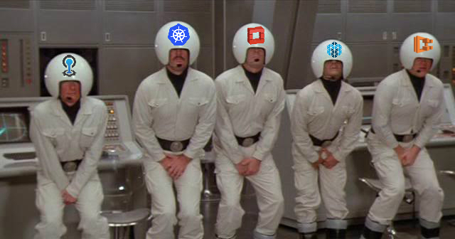

# S01E02: Атака клонов и Шары Девопса

</img>

<audio style="width: 100%" preload='auto' controls>
    <source src="{{ page.enclosure.url }}" />
</audio>

[Скачать]({{ page.enclosure.url }})

### Описание выпуска
Эпизод называется "Атака клонов и Шары Девопса". Почему так, спросите Вы? Потому что ~~надо знать классику~~ за последнее время развелось огромное множество разных, похожих друг на друга систем оркестрации, и сегодня мы поговорим именно про них. А шары... ну... услышите :D

### Участники
* **Кирилл [@tolkv](https://twitter.com/tolkv) Толкачёв**
* **Сергей [@bsideup](https://twitter.com/bsideup) Егоров**
* **Слава [@php_coder](https://twitter.com/php_coder) Семушин** из RedHat, работает над OpenShift
* **Андрей [@andrey_kurilin](https://twitter.com/andrey_kurilin) Курилин** из OpenStack, Project Team Lead проекта Rally

### Темы
* Оркестрация приложения. Виртуальных машин. Инфраструктуры. Где тут OpenStack и OpenShift? В чем разница? Немного о Mesos
* Как обстоят дела с постоянным хранилищем в эпоху контейнеров
* Что использовать? OpenStack? Kubernetes? AWS Services? Мозг?
* https://hyper.sh/
* Шары Девопса – как прошла конференция devops.by

### Что мы вынесли из этого эпизода
* **OpenShift** – готовая сборка, интегрирующая всякие тулзы в одну коробку. Больше, чем в Kubernetes
    1. Решена проблема с корпоративными проксями
    1. Для персистенса тоже есть решения. RH вроде для этого прикрутил GlusterFS 

        https://www.redhat.com/en/technologies/storage/gluster
    1. Динамическое создание Persistent Volume в OpenShift 

        https://docs.openshift.org/latest/install_config/persistent_storage/storage_classes.html
    1. Руководство по установке OpenShift в on-premise от Виктора:

        https://github.com/vektory79/JenkinsArticles/blob/master/OpenShift/installAndTips.md
* **OpenStack** – по сути свой VPS
    1. поддержка Docker там есть, можно бутать контейнеры через драйвер Docker для OpenStack
    1. Проект Rally - бенчмарк провайдера виртуалок на OpenStack

        http://docs.openstack.org/developer/performance-docs/
    1. Быстрый старт

        http://docs.openstack.org/developer/devstack/

        http://docs.openstack.org/developer/fuel-docs/userdocs/fuel-install-guide.html
* Все развивается настолько быстро, что документация скорее всего будет не актуальна в нужный момент. Подписывайтесь на блоги/rss feeds/github watches
    
    http://blog.kubernetes.io/
   
    https://blog.openshift.com/

* Нет хороших конференций на эту тему на постсоветском пространстве!

Напоминаем, что Вы всегда можете обсудить данный выпуск в нашем Gitter канале: https://gitter.im/2d1o/Lobby

### Благодарности
Спасибо нашим гостям за интересную информацию. 

Так же спасибо  [Антону Архипову](https://twitter.com/antonarhipov) за микрофон :)