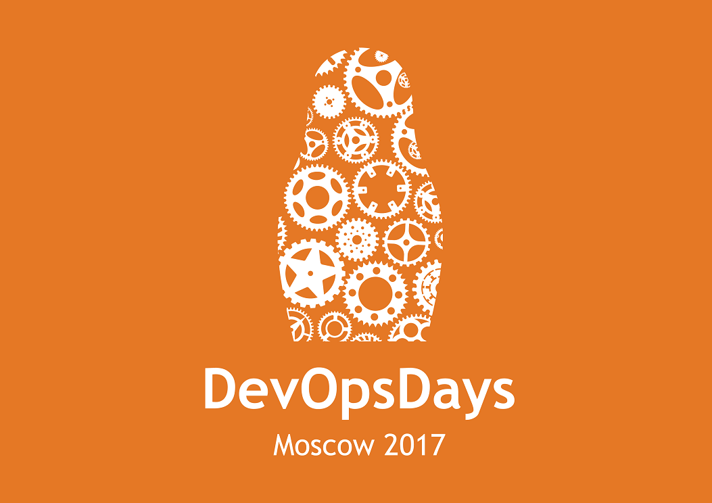

# S01E06: DevOpsDays Moscow 2017

</img>

<audio style="width: 100%" preload='auto' controls>
    <source src="{{ page.enclosure.url }}" />
</audio>

[Скачать]({{ page.enclosure.url }})

### Описание выпуска
Мы побывали на DevOpsDays Moscow 2017 и опросили аж троих участников этого события, прямо во время конференции!

### Участники

1. **Кирилл [@tolkv](https://twitter.com/tolkv) Толкачёв**
2. **Сергей [@bsideup](https://twitter.com/bsideup) Егоров**
3. **Александр [@osminog](https://twitter.com/osminog) Титов из [Express42](https://express42.com)**
4. **Михаил [@mskuzmin](https://twitter.com/mskuzmin) Кузьмин из [JetBrains](https://jetbrains.com)**
5. **Александр [@aatarasoff](https://twitter.com/aatarasoff) Тарасов из [ok.ru](https://ok.ru)**

### Темы

1. Александр Титов
    1. О конференции
    1. Что общего у разработки электроники и DevOps
    1. Как связаны DevOps и квадракоптеры
    1. У разработки ПО и электротехники гораздо больше общего чем кажется
1. Михаил Кузьмин
    1. Из аналитика в DevOps практика!
    1. Что есть DevOps и чем DevOps команды должны заниматься
    1. Terraform в JetBrains
    1. Как догфудят TeamCity в JetBrains
    1. Как тестируют IntelliJ IDEA
    1. Build as a Code в TeamCity
    1. Декларативные билды в TeamCity - хорошо это или не очень?
    1. [Распределённые выполнения тестов в TeamCity на примере Badoo](https://www.youtube.com/watch?v=gAisPsfbLkg)
    1. Автоскейлинг TeamCity агентов
1. Александр Тарасов
    1. Может ли DevOps... Надоесть?
    1. Есть ли DevOps в Одноклассниках
    1. Кроме Dev и Ops есть ещё и QA
    1. Свой ООП добрался до 2d1o! 
    1. Новый способ Delivery от Кирилла - доставляем WAR-ники тележкой
    1. DevOps в банках
1. Александр Титов
    1. Впечатления от конференции
    1. Формирование DevOps сообщества
    1. Будущее русского DevOps движения

### Выводы
1. DevOps-у в России - быть!
1. Иногда заниматься одним только DevOps процессом можно задолбаться :D
1. Даже в компаниях типа JetBrains можно найти много DevOps-а

----
Напоминаем, что Вы всегда можете обсудить данный выпуск в нашем Gitter канале: https://gitter.im/2d1o/Lobby
